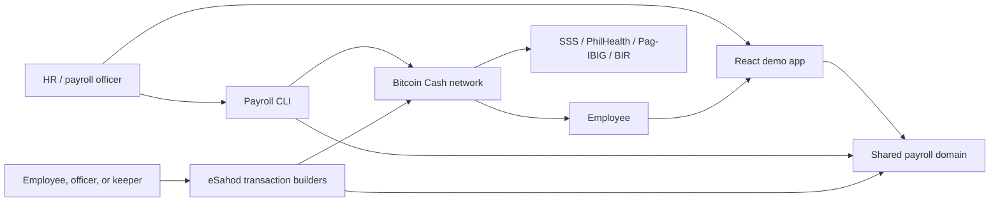
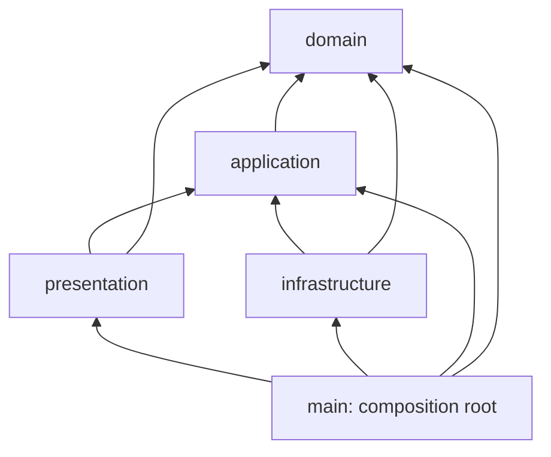
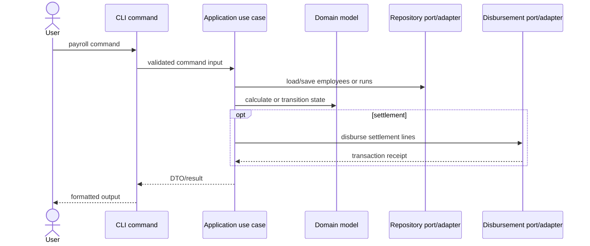

# eSahod Architecture

eSahod is an automated Philippine private-sector payroll prototype built on Bitcoin Cash and CashScript. The repository contains a dependency-controlled payroll core, a command-line application, a judge-facing React demo, and the CashScript covenants and transaction tooling for the eSahod CashToken protocol.

This document describes the repository as implemented. In particular, the browser app currently uses a persistent mock chain; the eSahod scripts and infrastructure modules are the paths that construct real CashScript transactions.

## System context



The architectural centre is the dependency-free domain under `src/domain`. It owns payroll arithmetic, employment commitments, schedules, entities, and value objects. Both off-chain transaction construction and the UI import this code instead of maintaining separate payroll calculations.

## Repository map

| Area | Responsibility |
|---|---|
| `src/domain` | Pure business rules: employees, payroll runs, statutory deductions, schedules, settlement values, and the 40-byte employment commitment codec. |
| `src/application` | Use cases and ports. Coordinates domain objects without knowing about files, terminals, CashScript, or network providers. |
| `src/infrastructure` | Adapters for JSON/in-memory persistence, system services, address validation, network providers, CashScript contracts, and transaction construction. |
| `src/presentation` | CLI parsing, commands, presenters, tables, and output abstractions. |
| `src/main` | Composition root and executable CLI entry point. This is the only layer that wires all other layers together. |
| `contracts` | CashScript covenant sources: the eSahod treasury and employment vault, plus the simpler BCH treasury used by the generic CLI gateway. |
| `scripts/esahod` | Operational sequence for key generation, deployment/genesis, employee enrolment, payroll, amendments, and BCMR publication. |
| `app` | React/Vite judge-facing demo for treasurer, HR, employee, attendance, and schedule views. |
| `bcmr` | Bitcoin Cash Metadata Registry template and publication documentation. |
| `artifacts` | Compiled CashScript artifacts consumed by adapters and scripts. |
| `tests` | Unit, use-case, repository-contract, CLI, transaction, covenant-attack, and architectural dependency tests. |

## Clean-architecture dependency rule

Production dependencies point inward:



- `domain` imports neither third-party packages nor Node built-ins.
- `application` imports only application and domain modules.
- `infrastructure` implements application ports and contains external dependencies.
- `presentation` may depend on application and domain, but not infrastructure.
- `main/container.ts` constructs adapters and injects them into use cases and commands.

`tests/architecture/dependency-rule.test.ts` scans source imports and enforces these constraints, including confinement of CashScript and libauth dependencies to infrastructure.

## Runtime surfaces

### CLI application

The CLI follows a conventional ports-and-adapters request path:



The composition root chooses:

- in-memory or JSON-file repositories;
- mock or Electrum-backed network configuration;
- system clock, UUID generation, logging, and libauth address validation;
- the CashScript disbursement gateway, initialized lazily so non-chain commands do not require a network connection.

The generic CLI settlement adapter uses `simple_bch_treasury.cash` and pays a complete payroll run in one BCH transaction. It is distinct from the CashToken-based eSahod protocol described below.

### React demo app

The frontend is a separate Vite application. Screens access external state only through `ChainGateway`:

```text
React pages -> useChainState -> ChainGateway -> MockChainGateway -> localStorage
                         \\-> future Chipnet adapter
```

`MockChainGateway` uses the real domain commitment codec, deduction calculation, and output-layout logic, but it does not broadcast transactions. It persists the simulated treasury, employment NFT state, and payroll history in browser storage. The gateway seam is intentionally small so a network adapter can replace it without rewriting pages.

Attendance views have their own gateway abstraction. Attendance anchoring code also exists under `src/infrastructure/blockchain/esahod`, but the demo UI should not be read as proof that punches are currently submitted to Chipnet.

## On-chain eSahod protocol

The protocol uses two mutually reinforcing covenants.

### PayrollTreasury

`contracts/payroll_treasury.cash` holds ePHP fungible CashTokens, where one token unit represents one centavo. Its principal path, `paySalary`, is permissionless: no signature selects the employee payment address or amount. Instead, the covenant derives them from the employment NFT and statutory rules and requires the transaction outputs to match.

The covenant verifies the employee status and period, payday locktime, token categories, recipients, amounts, returned NFT, treasury remainder, and satoshi floors. A separate treasurer-signed lapse path recovers unused funding after the configured cycle expires.

### EmploymentVault

`contracts/employment_vault.cash` holds mutable employment NFTs. Its `payroll` path requires the record to be input 1 and the designated treasury to be input 0. This prevents a genuine record from being advanced by a look-alike treasury that does not pay the employee.

Its HR-signed `amend` path preserves the NFT category and mutable capability and forbids `nextPeriod` from moving backwards. Amendments may relocate a record to a new vault, which supports migration to a new funding cycle.

Neither covenant provides the complete guarantee alone: the treasury validates the record and payout, while the vault validates the treasury consuming the record.

### Employment commitment

Each employee is represented by a mutable CashToken NFT with a fixed 40-byte commitment:

| Offset | Size | Field | Purpose |
|---:|---:|---|---|
| 0 | 20 | `payeePkh` | Employee wallet public-key hash. |
| 20 | 4 | `monthlyBasic` | Monthly basic salary in centavos. |
| 24 | 4 | `monthlyAllowance` | Monthly allowance in centavos. |
| 28 | 4 | `taxPerPeriod` | HR-computed withholding for the period. |
| 32 | 2 | `nextPeriod` | Monotonic anti-double-payment counter. |
| 34 | 2 | `endPeriod` | Final payable period. |
| 36 | 1 | `status` | Active or inactive employment state. |
| 37 | 3 | `employeeNo` | Company employee number. |

The codec lives in `src/domain/payroll/commitment.ts`; shared offsets and output layouts live in `src/domain/payroll/types.ts`.

### Atomic payroll transaction

One employee and one period are settled per eSahod transaction:

```text
Inputs                              Outputs
0  PayrollTreasury ePHP UTXO   ->   0  employee net pay
1  Employment NFT UTXO        ->   1  SSS remittance
2+ BCH fee UTXOs               ->   2  PhilHealth remittance
                                     3  Pag-IBIG remittance
                                     4  BIR withholding (omitted when zero)
                                     5  advanced Employment NFT
                                     6  remaining ePHP to treasury
                                     7+ BCH fee change, if required
```

When the BIR amount is zero, the output is omitted and later indexes shift. `outputLayoutFor` is the shared source of truth for this layout. Fee UTXOs fund dust and miner fees; covenant checks prevent the permissionless broadcaster from stripping BCH from the treasury or employment NFT.

`src/infrastructure/blockchain/esahod/payroll-transaction.ts` builds this exact shape and sets the transaction locktime from `genesisTime + nextPeriod * periodSeconds`.

## Payroll lifecycle

1. Generate HR, treasury, and fee-payer keys.
2. Deploy a treasury and matching employment vault.
3. Mint the ePHP supply and employment NFTs in genesis, placing records directly in the vault.
4. Destroy the category's minting authority in the same genesis transaction.
5. Fund the treasury and fee payer with sufficient BCH for token-output dust and fees.
6. At payday, any party may build and broadcast a transaction satisfying both covenants.
7. The transaction atomically sends net pay and all remittances, advances `nextPeriod`, and returns the remaining ePHP to the treasury.
8. HR uses the signed amendment path for terms, status, wallet, or cycle migration without rewinding paid periods.

The destroyed minting authority is an important trust boundary: retaining an unconstrained minting NFT would allow forged employment records of the trusted category to drain lawful-looking payments from the treasury. Supporting post-genesis hiring therefore requires a future issuance design that constrains the commitment being minted, not merely the destination vault.

## Data and consistency

- Monetary amounts use integers (`bigint`) in centavos or satoshis; floating-point arithmetic is not used for payroll.
- The domain computes SSS, PhilHealth, Pag-IBIG, tax allocation, net pay, and total treasury draw.
- The treasury covenant independently enforces the verifiable statutory expressions and exact output shape.
- Withholding tax is supplied in the employment commitment because correct tax depends on information that is not fully available on chain; the covenant guarantees remittance of the committed amount rather than pretending to calculate it.
- CLI entities are stored through repository interfaces. Implementations are in-memory or JSON-file based.
- Browser demo state is stored separately in local storage and is not the CLI repository or blockchain state.

## Configuration and deployment

The CLI reads environment configuration once in `src/infrastructure/config/payroll-configuration.ts`. Important options include network, mock versus Electrum chain mode, memory versus file persistence, data directory, operator key, treasurer public-key hash, payout interval, and fee rate. Real Electrum mode requires the configured keys.

Contracts are compiled by `scripts/compile-contracts.ts` into `artifacts`. The numbered scripts in `scripts/esahod` define the operational Chipnet workflow. `bcmr/registry.json` is a registry template; publication is a separate explicit operation and should not be assumed from the file's presence.

## Security and trust boundaries

| Boundary | Guarantee | Remaining trust / limitation |
|---|---|---|
| Treasury covenant | Exact token category, amounts, recipients, record progression, timing, and treasury change are enforced by BCH consensus. | Statutory constants require a new contract when rules change. |
| Employment vault | Only its designated treasury may consume payroll records; HR cannot rewind paid periods. | HR can lawfully amend most employment terms and status. |
| Token genesis | Destroying minting authority closes forged-record issuance after genesis. | Post-genesis hiring needs a constrained issuance protocol. |
| Tax field | The committed tax amount must reach BIR atomically with salary. | HR remains responsible for calculating the correct tax amount. |
| Permissionless trigger | Broadcasters cannot redirect funds or reduce protected satoshi values. | Someone must still supply fee UTXOs and broadcast a valid transaction. |
| Demo UI | Reuses production domain arithmetic and byte layouts. | Current `MockChainGateway` is simulated local state, not chain verification. |

## Verification strategy

- Domain tests cover values, entities, schedules, commitment encoding, and statutory calculations.
- Application tests exercise use cases through fake ports.
- Repository contract tests hold persistence implementations to the same behaviour.
- Infrastructure tests cover transaction construction, genesis, attendance anchoring, and disbursement adapters.
- Adversarial covenant tests demonstrate rejected mutations and known trust-boundary attacks.
- CLI tests exercise the composed presentation path.
- The architecture test prevents dependency direction from silently drifting.

The standard project verification commands are:

```bash
npm run typecheck
npm test
npm run contracts:compile
npm --prefix app run typecheck
npm --prefix app run build
```

## Key design decisions

1. **Atomic remittance:** employee net pay and four statutory destinations share one transaction, eliminating partial settlement states.
2. **Permissionless execution with no discretion:** the trigger is public because the covenant fixes the valid result.
3. **Employment state in an NFT:** payee, pay terms, status, and the anti-replay period counter travel together as a consensus-visible record.
4. **Pure shared domain:** off-chain builders and UI views use one arithmetic and codec implementation.
5. **Explicit seams:** application ports isolate repositories, time, identifiers, logging, validation, and blockchain settlement.
6. **Honest demo boundary:** mocked browser state and real transaction tooling are separate and documented as such.

